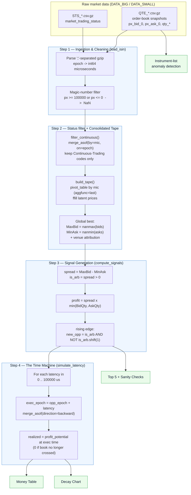
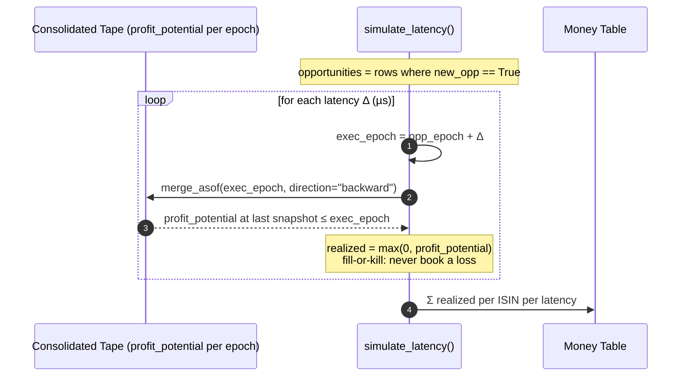
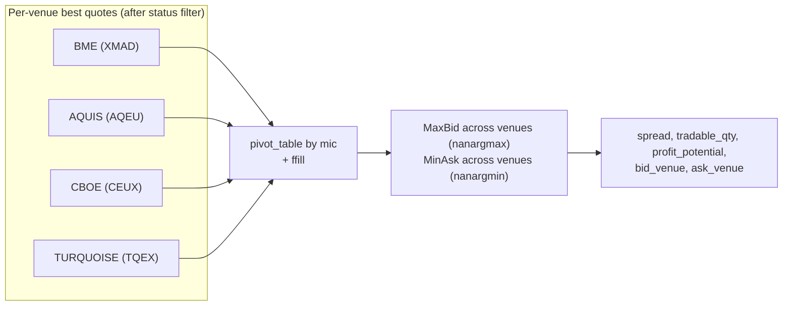

# Pipeline Diagram — Cross-Venue Arbitrage

Visual reference for the corrected pipeline implemented in
[`notebooks/Arbitrage_Analysis_Corrected.ipynb`](../notebooks/Arbitrage_Analysis_Corrected.ipynb).
All diagrams are [Mermaid](https://mermaid.js.org/) and render directly on GitHub / VS Code.

---

## 1. End-to-end data flow

---

## 2. The "Time Machine" (latency lookup)

How a signal detected at `T` is revalued at execution time `T + Δ`.

---

## 3. Consolidated tape construction (per venue → global best)

---

### Legend / key design choices

| Choice | Why |
|--------|-----|
| Integer µs `epoch` everywhere | Latency added in native microseconds — avoids datetime unit bugs. |
| `merge_asof(by="mic")` for status | Each quote is matched to its **own** venue's latest trading phase. |
| `ffill` on the pivoted tape | A price stays "latent" (addressable) until the venue publishes a new one. |
| Rising edge (`shift(1)`) | A crossed book persists across many µs snapshots; count each opportunity once. |
| `min(BidQty, AskQty)` | You can only arbitrage the smaller of the two legs. |
| Fill-or-kill (`clip(lower=0)`) | Optimistic assumption: unexecuted legs are cancelled, never realising a loss. |
