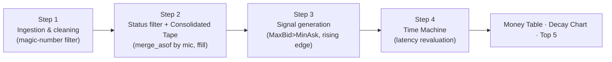

# High-Frequency Arbitrage in Fragmented Markets
## Lab Exercise — Spanish Equity Markets (BME + MTFs)


Detection of cross-venue arbitrage opportunities in Spanish equities trading simultaneously on
**BME** and the MTFs **CBOE, Turquoise and Aquis**, and measurement of how quickly the profit
decays with execution latency.

Author: Piettro Rodrigues

---

## 1. The problem

In modern European equity markets liquidity is **fragmented**: the same ISIN trades on several venues
at once, so temporary price discrepancies appear. A High-Frequency Trader can, in principle, buy on the
cheap venue and sell on the expensive one — but the edge is fleeting and disappears with latency.

As a Quantitative Researcher we answer three questions:

1. **Do** arbitrage opportunities still exist in Spanish equities?
2. **What is the maximum theoretical profit** (0-latency scenario)?
3. **How fast does the profit vanish** as the system gets slower (0 µs → 100 ms)?

---

## 2. Deliverable

The authoritative, graded notebook is:

> **[`notebooks/Arbitrage_Analysis_Corrected.ipynb`](notebooks/Arbitrage_Analysis_Corrected.ipynb)**

It is self-contained: every pipeline function is defined inside it, it reads the real
`DATA_BIG` files, and it produces the three required deliverables (Money Table, Decay Chart,
Top-5 + sanity checks) plus instrument-list anomaly detection.

> `notebooks/Arbitrage_Analysis_Complete.ipynb` is an earlier version, kept only as a backup.

For the design rationale see [`docs/ARCHITECTURE.md`](docs/ARCHITECTURE.md) and the
[`docs/PIPELINE_DIAGRAM.md`](docs/PIPELINE_DIAGRAM.md).

---

## 3. Method (4-step pipeline)


```mermaid
flowchart LR
    A["Step 1<br/>Ingestion & cleaning<br/>(magic-number filter)"]
    B["Step 2<br/>Status filter + Consolidated Tape<br/>(merge_asof by mic, ffill)"]
    C["Step 3<br/>Signal generation<br/>(MaxBid>MinAsk, rising edge)"]
    D["Step 4<br/>Time Machine<br/>(latency revaluation)"]
    A --> B --> C --> D --> E["Money Table · Decay Chart · Top 5"]
```

| Step | What it does |
|------|--------------|
| **1. Ingestion & cleaning** | Load `QTE` + `STS` per ISIN across venues; drop vendor **magic numbers** (`px ≥ 100 000` / `px ≤ 0`). |
| **2. Status + Consolidated Tape** | Keep only **Continuous-Trading** snapshots via `merge_asof` (by `epoch` **and** `mic`); pivot best bid/ask per venue and **forward-fill** latent prices; take the global MaxBid / MinAsk. |
| **3. Signal generation** | `Global Max Bid > Global Min Ask`; profit `= (MaxBid − MinAsk) × min(BidQty, AskQty)`; **rising-edge** rule so each opportunity is counted once. |
| **4. The Time Machine** | For each latency Δ, look up the *actual* profit at `T + Δ` (`merge_asof` on integer-µs epoch). Fill-or-kill: a vanished opportunity realises €0, never a loss. |

All timestamps are kept as **integer microsecond `epoch`**, so latency is added in native µs
(no datetime unit pitfalls).

---

## 4. Results — full `DATA_BIG` (session 2025-11-07)

| Metric | Value |
|--------|-------|
| ISINs processed | **195** (155 with usable data, 72 with ≥ 1 opportunity) |
| Rising-edge opportunities | **3,102** |
| Total realised profit @ 0 µs | **€3,611.39** |
| Total realised profit @ 100 ms | **€1,372.99** |
| Retention (100 ms / 0 µs) | **38.0 %** |

**Top 5 by zero-latency profit** — all Spanish blue chips, 100 % cross-venue, 2.8–18 bps spreads:

| # | ISIN | Instrument | Profit @ 0 µs | New opps |
|---|------|-----------|---------------|----------|
| 1 | ES0177542018 | IAG | €790.14 | 914 |
| 2 | ES0105065009 | Logista | €413.28 | 5 |
| 3 | ES0113211835 | BBVA | €389.15 | 66 |
| 4 | ES0105066007 | Cellnex | €277.29 | 95 |
| 5 | ES0144580Y14 | Iberdrola | €240.05 | 17 |

The profit **decays monotonically** with latency — the expected shape. IAG topping the list is a
useful sanity check: it saw heavy news-driven activity that session, which widens cross-venue spreads.

> **Interpretation.** After member fees (~0.3 bps per side) and two-legged execution risk, this
> raw edge is largely competed away — consistent with a heavily-exploited HFT space.

---

## 5. Quick start

### Prerequisites
```bash
python >= 3.10
pip install pandas numpy matplotlib jupyter
```

### Run
Open the notebook and, in the **Configuration** cell, set the data location:

```python
BASE = r"...\Tareas\Renta Variable"   # folder containing DATA_BIG / DATA_SMALL
USE_SMALL = False   # True -> quick test on DATA_SMALL ; False -> full DATA_BIG
MAX_ISINS = None    # e.g. 20 to cap the run; None = all
```

```bash
jupyter notebook notebooks/Arbitrage_Analysis_Corrected.ipynb
```

Start with `USE_SMALL = True` for a fast end-to-end smoke test, then switch to `False`
for the full run.

---

## 6. Data specification

**File naming:** `<type>_<session>_<isin>_<ticker>_<mic>_<part>.csv.gz` (files are `;`-separated).

**Magic numbers (discarded):** `666666.666`, `999999.999`, `999999.989`, `999999.988`,
`999999.979`, `999999.123` — handled with a single `px ≥ 100 000` threshold.

**Continuous-Trading status codes:**

| Venue | MIC | Code(s) |
|-------|-----|---------|
| BME | XMAD | 5832713, 5832756 |
| AQUIS | AQEU | 5308427 |
| CBOE | CEUX | 12255233 |
| TURQUOISE | TQEX | 7608181 |

**Latencies simulated (µs):** `0, 100, 500, 1000, 2000, 3000, 4000, 5000, 10000, 15000, 20000, 30000, 50000, 100000`.

---

## 7. Repository structure

```
Renta Variable/
├── notebooks/
│   ├── Arbitrage_Analysis_Corrected.ipynb   # ← authoritative deliverable
│   └── Arbitrage_Analysis_Complete.ipynb    # earlier version (backup)
├── src/
│   ├── extractors/extractor_base.py
│   └── models/
│       ├── consolidated_tape.py             # pivot + ffill + global best
│       ├── arbitrage_signals.py             # signals + rising edge
│       ├── latency_simulator.py             # time machine
│       └── tape_integration.py              # status integration
├── examples/                                # standalone per-step scripts
├── tests/                                   # pytest suites
├── documents/                               # assignment brief
├── docs/
│   ├── ARCHITECTURE.md
│   └── PIPELINE_DIAGRAM.md
└── README.md
```

---

## 8. Assumptions & limitations

- **Both legs execute together** (no partial-fill unwinding) — makes the P&L an optimistic upper bound.
- **Fill-or-kill:** vanished opportunities realise €0, never a loss.
- **Fees excluded:** member fees (~0.3 bps/side) and FX for non-EUR lines are not deducted.
- **Top-of-book, Level-2 only:** deeper levels and a full order-by-order matching engine are out of scope.
- **Book-emptying not modelled:** `ffill` keeps the last price latent (rare edge case noted in the lecture).

---

*Developed for the Master MIAX programme. Market-data specifications follow the vendor definitions
provided with the exercise.*
